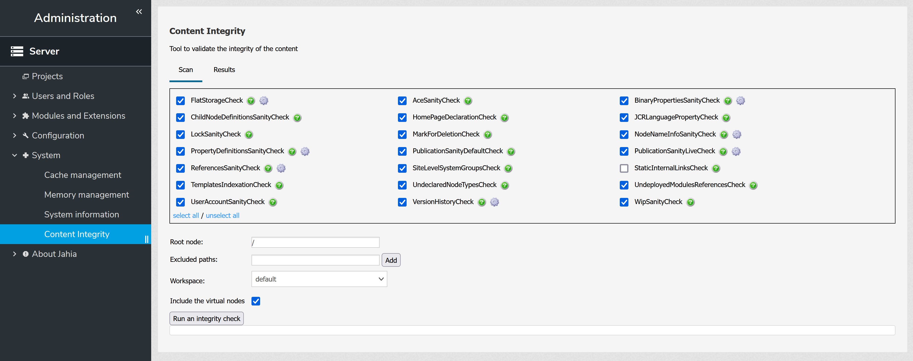

# Content Integrity
Jahia module that provides an extensible service to test the integrity of the content
* [How to use it](#how-to-use)
    * [Configuration](#configuration)
    * [UI](#how-to-use-ui)
    * [Karaf Shell commands](#karaf-shell-commands)
        * [jcr:integrity-check](#jcrintegrity-check) 
        * [jcr:integrity-printError](#jcr-integrity-printError) 
        * [jcr:integrity-printChecks](#jcr-integrity-printChecks) 
        * [jcr:integrity-printTestResults](#jcr-integrity-printTestResults) 
        * [jcr:integrity-configureCheck](#jcr-integrity-configureCheck) 
* [Embedded tests](docs/embedded-tests.md#summary)
* [FAQ](#faq)
* [How to extend it](docs/how-to-extend.md#summary) 
* [Groovy scripts](docs/groovy-scripts.md#summary)
* [Release notes](docs/release-notes.md#summary) 

## How to use?

### Configuration

Users require to be granted the permission `adminContentIntegrity` at server level to be able to run an integrity scan.

By default, this permission is added to the role `server-administrator`, thus any server administrator is able to use the feature.

### UI

The module registers an additional page in the administration.

All the available checks (provided by the module itself, or by extensions) are listed. Those configured as active are preselected. 

Some checks are configurable. A button is displayed in front of those to open the related configuration screen: 

The scan is executed on a tree, by default on the whole JCR, starting from its root node. To scan a single site, a specific section, the files hierarchy of a site, ... , specify the related root node as the root of the scan.

All the nodes under the specified one will be scanned, unless some subtrees are specified to be excluded. If needed, specify the path of the root nodes of those trees to skip.

The scan can be run on a single workspace, or on both.

Virtual nodes (e.g. exposed by an EDP connector) can be excluded from the scan. This is useful when processing those nodes involve a lot of connections to an 3rd party system, with an important impact on the duration of the scan.

When running a scan, the related logs are displayed in the UI. The scan is run in background, and leaving the screen will have no impact on its execution. When the scan is over, the results can be downloaded from the JCR (uploaded under `/sites/systemsite/files/content-integrity-reports`), or viewed in the UI, in the tab `Results`.

### Karaf Shell commands
The content integrity service is available through the [Karaf console](https://academy.jahia.com/documentation/system-administrator/jahia/8/installing-and-configuring-jahia/installing-configuring-and-troubleshooting-jahia/configuring-jahia-features#osgi-ssh-console).

Use `jcr:cd {path}` to position yourself on the node from which you want to start the scan.

Use `jcr:workspace {workspace}` if you want to change the workspace to scan.

Use `jcr:integrity-check` to run a content integrity test.

    jahia@dx()> jcr:cd /sites/mySite/
    /sites/mySite
    jahia@dx()> jcr:integrity-check
    Content integrity tested in 128 ms
    No error found
    jahia@dx()>
    
#### jcr:integrity-check  
Runs a scan of the current tree and current workspace.

**Options:**  

| Name     | alias     |         Value          | Mandatory | Multiple | Description                                                                                                                                                                                                                                                                                                                                                                             |
|----------|-----------|:----------------------:|:---------:|:--------:|-----------------------------------------------------------------------------------------------------------------------------------------------------------------------------------------------------------------------------------------------------------------------------------------------------------------------------------------------------------------------------------------|
| -l       | --limit   | positive integer, [20] |           |          | Specifies the maximum number of errors to print out                                                                                                                                                                                                                                                                                                                                     |
| -x       | --exclude |         string         |           |    x     | Specifies one or several subtrees to exclude                                                                                                                                                                                                                                                                                                                                            |
| -c       | --checks  |         string         |           |    x     | Specifies the checks to execute, specified by their ID.   Only the specified checks will be executed during the current scan, no matter the global configuration.  The check IDs can also be prefixed with ':' to specify a check to be skipped. In such case, the scan will execute all the currently active checks but those specified to be skipped during the current scan. |
| --skipMP |           |                        |           |          | If specified, the virtual nodes are excluded from the scan                                                                                                                                                                                                                                                                                                                              |

**Examples:**

    jcr:cd /sites/mySite/
    jcr:workspace live
    jcr:integrity-check -l 10   
    
    jcr:cd /sites
    jcr:integrity-check -x /sites/aHugeSite
    jcr:integrity-check -x /sites/aHugeSite -x /sites/anotherHugeSite/files 
                                                              
A scan can be interrupted before the end of its execution. Refer to the [FAQ section](#scan-interruption) for more details.

#### jcr:integrity-printError
Prints out some extended information about an error.

**Argument:**

| Value  | Mandatory | Multiple | Description                     |
|:------:|:---------:|:--------:|---------------------------------|
| string |     x     |    x     | ID of the error(s) to print out |

**Options:**

| Name | alias  | Value  | Mandatory | Multiple | Description                                                                  |
|------|--------|:------:|:---------:|:--------:|------------------------------------------------------------------------------|
| -t   | --test | string |           |          | ID of the test from which to load the error. Latest test used if not defined |

**Example:**

    jcr:cd /sites/mySite/
    jcr:integrity-check 
    Content integrity tested in 44 seconds (44609 ms)
    ID | Fixed | Error                          | Workspace | UUID                                 | Node type         | Locale | Message
    --------------------------------------------------------------------------------------------------------------------------------------------------------
    0  |       | PropertyConstraintsSanityCheck | default   | c847913d-64f1-4c23-a6f6-1b7833f8024f | jnt:page          | fr     | Missing mandatory property
    1  |       | PropertyConstraintsSanityCheck | default   | a60dc57a-0bd3-4908-9b58-7e60dc558a34 | jnt:page          | fr     | Missing mandatory property
    2  |       | PropertyConstraintsSanityCheck | default   | dbb81015-5cac-4887-90d5-68c9be704ac8 | mynt:internalLink | fr     | Missing mandatory property
    
    jahia@dx()> jcr:integrity-printError 2
    ID             | 0
    Check name     | PropertyConstraintsSanityCheck
    Check ID       | 8
    Fixed          | false
    Workspace      | default
    Locale         | fr
    Path           | /sites/mySite/home/missions/internalLink-3
    UUID           | dbb81015-5cac-4887-90d5-68c9be704ac8
    Node type      | mynt:internalLink
    Mixin types    |
    Message        | Missing mandatory property
    property-name  | node
    error-type     | EMPTY_MANDATORY_PROPERTY
    declaring-type | mynt:internalLink

#### jcr:integrity-printChecks 
Prints out the currently registered checks. 
                         
**Options:**

| Name | alias         |      Value      | Mandatory | Multiple | Description                       |
|------|---------------|:---------------:|:---------:|:--------:|-----------------------------------|
| -l   | --outputLevel | [simple] , full |           |          | Specifies the output level to use |

**Example:**

    jahia@dx()> jcr:integrity-printChecks
    Integrity checks (8):
       FlatStorageCheck (id: 1, priority: 0.0, enabled: true)
       HomePageDeclaration (id: 2, priority: 100.0, enabled: true)
       JCRLanguagePropertyCheck (id: 3, priority: 100.0, enabled: true)
       LockSanityCheck (id: 4, priority: 100.0, enabled: true)
       MarkForDeletionCheck (id: 5, priority: 100.0, enabled: true)
       PublicationSanityDefaultCheck (id: 6, priority: 100.0, enabled: true)
       PublicationSanityLiveCheck (id: 7, priority: 100.0, enabled: true)
       UndeployedModulesReferencesCheck (id: 8, priority: 100.0, enabled: true)
 
#### jcr:integrity-printTestResults   
Allows to reprint the result of a previous test.   
                         
**Options:**

| Name | alias                |         Value          | Mandatory | Multiple | Description                                                                                                                      |
|------|----------------------|:----------------------:|:---------:|:--------:|----------------------------------------------------------------------------------------------------------------------------------|
| -l   | --limit              | positive integer, [20] |           |          | Specifies the maximum number of errors to print out                                                                              |
| -d   | --dump               |                        |           |          | Dumps the errors into report files in temp/content-integrity/ if used. The limit option is ignored when dumping                  |
| -u   | --upload             |                        |           |          | Uploads the report files in the JCR instead of writing in on the filesystem. This option has no effect if not combined with `-d` |
| -ef  | --excludeFixedErrors |                        |           |          | Coming soon                                                                                                                      |

**Example:**

    jahia@dx()> jcr:integrity-check
    Content integrity tested in 141 ms
    No error found
    jahia@dx()> jcr:integrity-printTestResults -d
    Dumped into C:\DigitalExperienceManager-EnterpriseDistribution-7.2.3.0\tomcat\temp\content-integrity\default_2023_04_21-13_34_15_786-full.csv
    Dumped into C:\DigitalExperienceManager-EnterpriseDistribution-7.2.3.0\tomcat\temp\content-integrity\default_2023_04_21-13_34_15_786-full.xlsx
 
#### jcr:integrity-configureCheck   
Allows to configure a registered integrity check. Please note that for the moment, the configuration is reset when restarting the module implementing the check,
or when restarting the server.   
                         
**Options:**

| Name | alias          |    Value    | Mandatory | Multiple | Description                                                                                                                                         |
|------|----------------|:-----------:|:---------:|:--------:|-----------------------------------------------------------------------------------------------------------------------------------------------------|
| -id  |                |   string    |     x     |          | Specifies the identifier of the integrity check to configure                                                                                        |
| -e   | --enabled      | true, false |           |          | Enables the integrity check if `true`, disable it if `false`. Do not change the current status if not defined                                       |
| -p   | --param        |   string    |           |          | Name of the parameter to configure. Depends on the integrity check specified with `-id`. If no value is specified, the current value is printed out |
| -v   | --value        |   string    |           |          | Value of the parameter to configure. Depends on the parameter specified with `-p`. Depends on the integrity check specified with `-id`              |
| -rp  | --resetParam   |   string    |           |          | Name of the parameter to reset to its default value                                                                                                 |
| -pc  | --printConfigs |   string    |           |          | Print all the configurations of the specified check                                                                                                 |

**Example:**

    jahia@dx()> jcr:integrity-printChecks
    Integrity checks (11):
       FlatStorageCheck (id: 2, priority: 0.0, enabled: true)
       [...]
    jahia@dx()> jcr:integrity-configureCheck -id 2 -e false
    jahia@dx()> jcr:integrity-printChecks
    Integrity checks (11):
       FlatStorageCheck (id: 2, priority: 0.0, enabled: false)
       [...]
    jahia@dx()> jcr:integrity-configureCheck -id 2 -pc
    FlatStorageCheck:
        threshold = 500 (Number of children nodes beyond which an error is raised)
    jahia@dx()> jcr:integrity-configureCheck -id 2 -p threshold
    FlatStorageCheck: threshold = 500
    jahia@dx()> jcr:integrity-configureCheck -id 2 -p threshold -v 200
    FlatStorageCheck: threshold = 200
    jahia@dx()> jcr:integrity-configureCheck -id 2 -rp threshold
    FlatStorageCheck: threshold = 500

 
#### jcr:integrity-fix
Coming soon    

## FAQ

### Scan interruption

You can interrupt a running scan from the UI, or by defining a system property named `modules.contentIntegrity.interrupt`. 
You can for example run the following script in a groovy console:

    System.setProperty("modules.contentIntegrity.interrupt", "true")

### Clustered environment

Most of the checks are purely related to the JCR, and do not need to be executed on every server in the cluster. The scan can be run on any server, not just the processing server.

The following checks rely on some local resources, and should be run on every server in a cluster:
* TemplatesIndexationCheck

In the UI, the checks to execute can be easily selected. If using the Karaf Shell, refer to [jcr:integrity-check](#jcrintegrity-check) to run a scan with a specified list of checks to execute.
